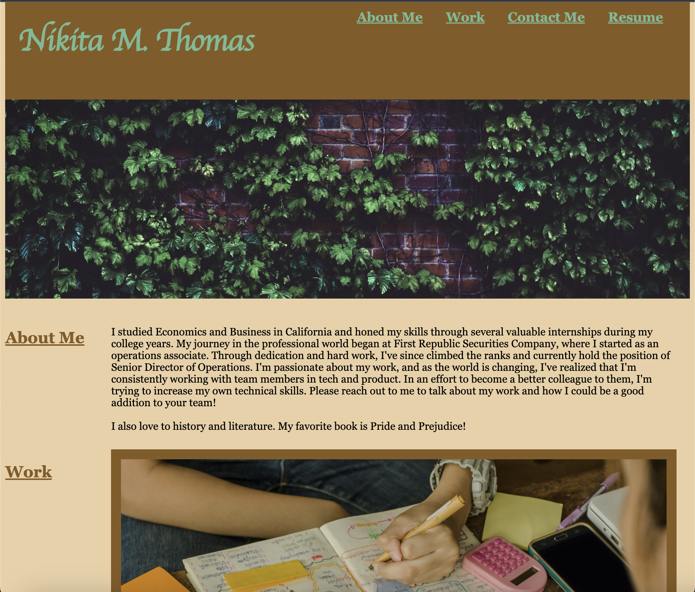

# <Week-1-Horiseon>

## Link
https://nikitaaa95.github.io/Week-2-Personal-Webpage

## Description

The purpose of this site is to provide future employers and other partners to see some information about me and some samples of my work.

## Installation

N/A

## Usage

Please use this site to learn more about me and better understand how I could make an excellent addition to your team. 

If you  like what you see, then you can use the contact me sections to see the best methods to reach out to me!

## Credits
### Tutorials and Aids  used for this project
Link Formatting
https://www.w3schools.com/css/css_link.asp

CSS Guidance
https://www.w3schools.com/css/css_rwd_templates.asp

Extra Font Families
https://www.w3.org/Style/Examples/007/fonts.en.html

HTML Break 
https://www.w3schools.com/tags/tag_br.asp#:~:text=The%20tag%20inserts%20a,it%20has%20no%20end%20tag.

Image Fit
https://stackoverflow.com/questions/50542629/make-image-fit-css-grid

Construction Page
https://loriballen.com/under-construction-page/

Phone Links
https://www.elegantthemes.com/blog/wordpress/call-link-html-phone-number#:~:text=Adding%20an%20HTML%20Phone%20Number%20Call%20Link%20to%20your%20Website,-Add%20the%20code&text=Href%3Dtel%3A%20creates%20the%20call,the%20number%20it%20will%20call

Opacity Effect
https://www.w3schools.com/howto/howto_js_tab_img_gallery.asp

### Images and other third party assets
Student Notes Image
https://www.oxford-royale.com/articles/the-best-way-to-write-study-notes/

Photography Image
https://www.veranda.com/travel/g36674338/beautiful-mountains/

Ivy Picture
https://www.pexels.com/search/ivy/

## Website Screenshot

